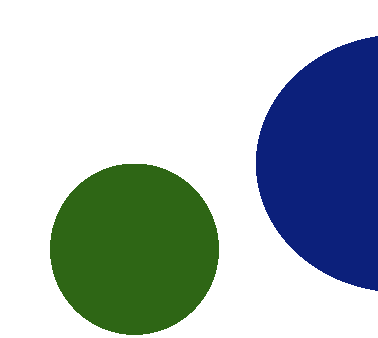
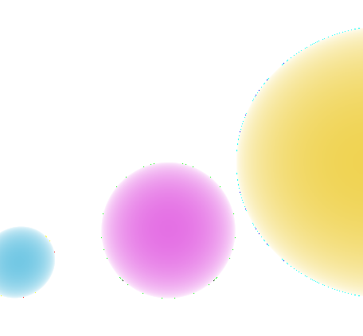
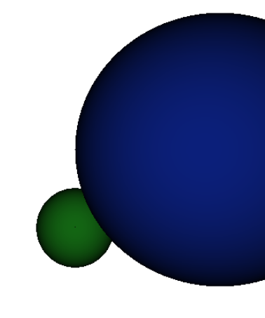
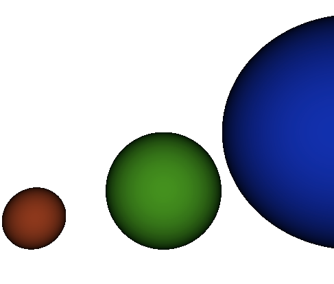
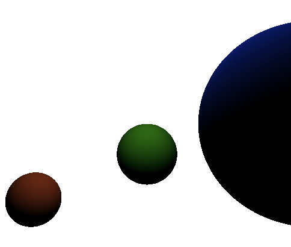

# Raytracer
## Alexander Shah, Angela Chang, Aiden Benner

## Description
Raytracer built in C++, capable of producing pretty circles.

###Progressions

#### Created a 2D circle

#### Created a 2D circle with varying light intensities

#### Created a 3D circle with varying light intensities

#### Almost there!

#### Shadow effect complete.

  <h4> Created a 2D circle </h4>
  

