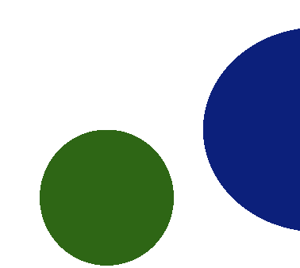
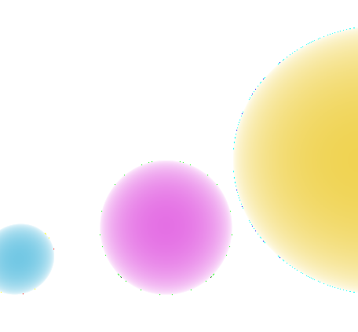
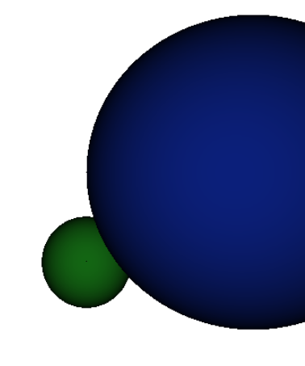
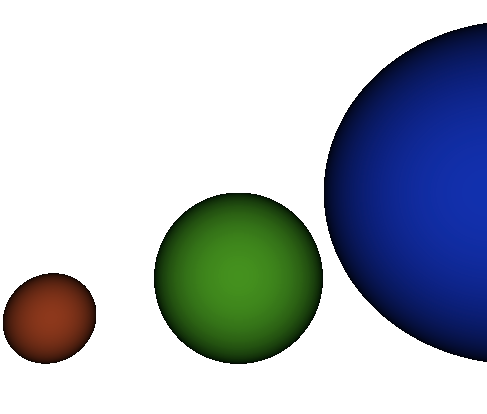

# Raytracer
## [Alexander Shah](github.com/ZanderShah), [Angela Chang](github.com/changangela), [Aiden Benner](github.com/aidenbenner)

  

## Description
Raytracer built in C++, capable of producing pretty circles.

###Progressions

#### Created a 2D circle

  

#### Created a 2D circle with varying light intensities

  

#### Created a 3D circle with varying light intensities

  

#### Almost there!

  

#### Shadow effect complete.

  

