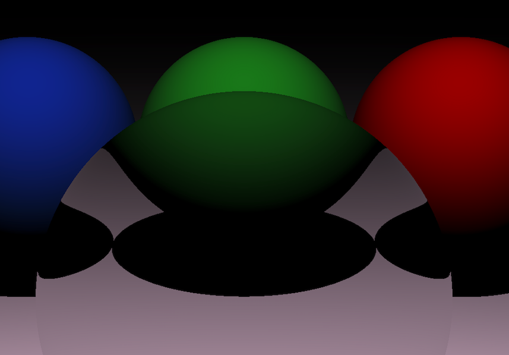
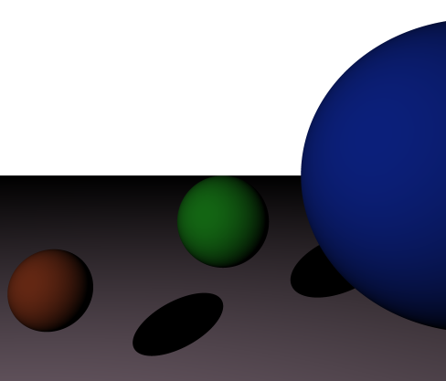

# Raytracer

[Alexander Shah](https://github.com/ZanderShah), [Angela Chang](https://github.com/changangela), [Aiden Benner](https://github.com/aidenbenner)

## Description
Raytracer built in C++ without any external libraries - capable of producing pretty circles. And planes.

## Progressions

### Phong reflection

  

### Montecarlo integration for soft shadows

  

### Refractions

  

### Corner shadow

  

### Experimenting with refraction

  

### Experimenting with reflections: spherical mirror 

  

### Created plane for cooler shadow effect

  

### Shadow effect complete

  

### Almost there!

  

### Created a 3D circle with varying light intensities

  

### Created a 2D circle with varying light intensities

  

### Created a 2D circle

  

